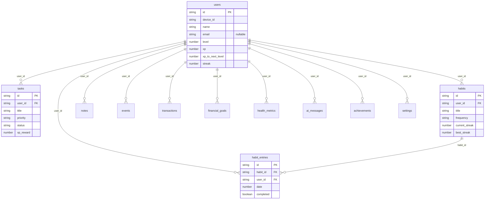
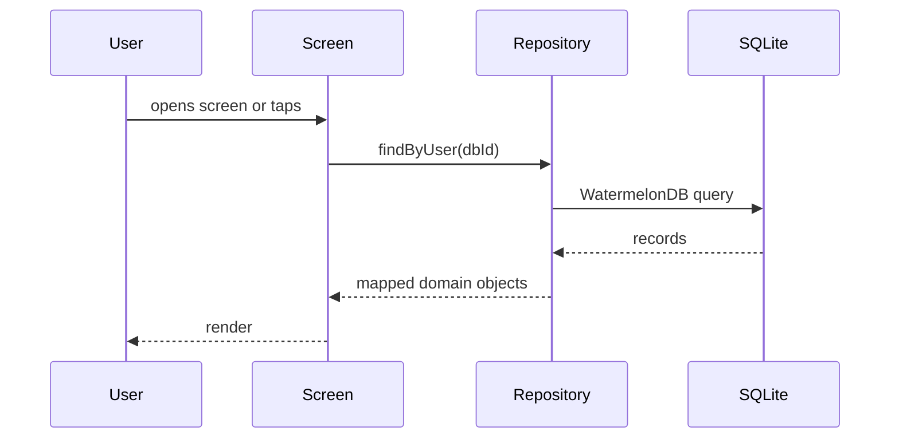
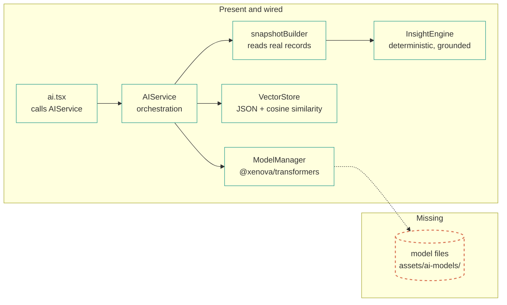
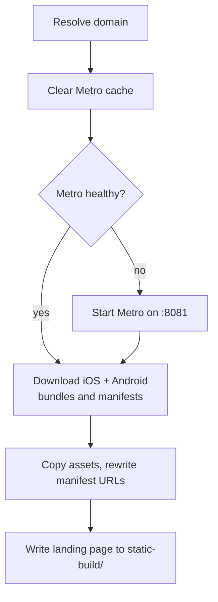

# Architecture

**`pre-release`** · verified `2026-09-29` · ~9 min read

This document describes the code as it exists. Where the intended design differs from the
current implementation, both are stated and the difference is called out.

> [!IMPORTANT]
> The central architectural fact: **the UI layer does not use the database layer.** No file
> under `app/` imports `lib/database`. Screens obtain data from Zustand stores backed by
> AsyncStorage, or from module-level constants. Everything in
> [§2 Data layer](#2-data-layer) is real, tested code that is simply not yet reachable from
> the screens.

## Contents

1. [Design principles](#1-design-principles)
2. [Data layer](#2-data-layer)
3. [Service layer](#3-service-layer)
4. [State layer](#4-state-layer)
5. [UI layer](#5-ui-layer)
6. [AI layer](#6-ai-layer)
7. [Intended vs. actual](#7-intended-vs-actual)
8. [Storage boundaries](#8-storage-boundaries)
9. [Build and delivery](#9-build-and-delivery)

---

## 1. Design principles

1. **Local-first.** No backend exists. There is no network client in the app.
2. **Type safety end to end.** `tsc --noEmit` is clean; typed routes and React Compiler are
   enabled in `app.json`.
3. **Test the logic, not the mocks.** Where possible, tests exercise real implementations.
4. **No dependency without native support.** `@shopify/react-native-skia` and `lancedb` were
   both removed during development because they could not run.

> [!NOTE]
> "Offline-first" is currently trivially true: the app never makes a network request.

## 2. Data layer

**Status: implemented and tested, not connected to the UI.**

Twelve tables, schema version 1: `users`, `tasks`, `habits`, `habit_entries`,
`health_metrics`, `transactions`, `financial_goals`, `notes`, `events`, `ai_messages`,
`achievements`, `settings`. Every foreign key is indexed, as are the columns used for range
queries (`health_metrics.date`, `events.start_date`).

Model behaviour

One model per table in `lib/database/models/`, each with `@field` / `@date` / `@readonly`
decorators. Where behaviour is domain logic rather than plain data, the model carries methods.

| Model | Behaviour |
| :-- | :-- |
| `User` | `addXP()` (multi-level), `updateStreak()` — see note below; neither has a production caller |
| `Task` | `complete()`, `updateStatus()`, `updatePriority()`, `addTag()`, `removeTag()`, `parsedTags`, `isOverdue` |
| `Habit` / `HabitEntry` | Streak tracking, `habit_entries` via `@children` |
| `Note` / `Event` / `Transaction` / `FinancialGoal` | Status transitions, date helpers |
| `AIMessage` / `Achievement` / `Setting` | Chat history, unlock records, key/value config |

> [!NOTE]
> **XP does not currently flow through the `User` model.** The live write path is
> `useAuthStore().addXP()`, which mutates `user.xp` / `level` / `streak` on the in-memory
> Zustand profile. `User.addXP()` exists and is exercised only by tests — it has no
> production caller. Because the Zustand `partialize` omits `user`, nothing writes those
> values back to SecureStore, so **every XP award is lost on cold start**. Tracked as an
> open item in `docs/followups.md`; not a v1.1 launch blocker. Fixing it means either
> including `user` in `partialize` (after deciding what is safe to persist) or writing XP
> through the model inside `database.write()` and rehydrating on init.

> [!WARNING]
> Two rules govern every model, and violating either throws at runtime:
>
> 1. `Model.update()` only works **inside a writer block**. Callers must wrap mutations in
>    `database.write(async () => { ... })`.
> 2. **Never assign to `@readonly` fields.** `createdAt` and `updatedAt` are
>    `@readonly @date`; WatermelonDB maintains them. Assigning throws
>    `Attempt to set new value on a property marked as @readonly`.
>
> `collection.query(fn)` also does not exist in 0.27 — use `Q.where(...)`.

### Adapter and readiness

`lib/database/database.ts` builds a `SQLiteAdapter` (db name `HyperVerse`, `jsi: true`) and a
`Database` singleton, and exposes `isDatabaseReady()`, `whenDatabaseReady()`,
`resetDatabase()`, `closeDatabase()`, and a `declare module` augmentation giving
`database.get<T>(name)` its return type.

`whenDatabaseReady()` tolerates adapters that do not expose `initializingPromise` — the
pure-JS LokiJS adapter used in tests does not — falling back to an already-resolved promise,
since WatermelonDB's work queue already serialises calls until the adapter is set up.

### Migrations

There are none. `lib/database/migrations/` was removed: schema version 1 already creates every
table, and the previous files called a `migration` API that does not exist in WatermelonDB
0.27. Adding tables later requires introducing a real migration list.

## 3. Service layer

**Status: implemented and tested; only authentication is used by the UI.**

| File | Role |
| :-- | :-- |
| `lib/services/AuthService.ts` | Device identity, SecureStore persistence, biometrics, profile CRUD, JSON export |
| `lib/services/BaseService.ts` | Base class with result helpers |
| `lib/storage.ts` | `safeGetItem` / `safeSetItem` / `safeDeleteItem` over SecureStore |
| `lib/logger.ts` | Levelled logger; optional `sentry-expo` behind a DSN check |

`AuthService` is a singleton (`AuthService.getInstance()`) and is the only service the screens
call. Production call sites are `app/(auth)/setup.tsx`, `app/(auth)/unlock.tsx`,
`app/(tabs)/settings.tsx`, and `components/auth/useAppUnlock.ts` — the last of which runs on
every cold start, rehydrating the profile and re-deriving `dbId` before the router mounts.

`lib/logger.ts` requires `sentry-expo` inside a `try/catch` and initialises it only if
`EXPO_PUBLIC_SENTRY_DSN` is set. **Crash reporting is off by default and untested against a
real DSN.**

## 4. State layer

**Status: implemented. This is what the UI actually reads from.**

| Store | Holds | Persisted |
| :-- | :-- | :-- |
| `authStore` | `user`, `isAuthenticated`, `isLoading` | No |
| `themeStore` | `themeMode`, `accentColor` | No |

The AsyncStorage-backed `dataStore` has been **removed**. Domain state now lives in SQLite and is
read through `lib/database/repositories`, so there is a single source of truth rather than a
Zustand cache that shadows the database.

`@tanstack/react-query` was installed with a `QueryClientProvider` mounted in the root layout but
had **no query hooks anywhere**. The provider and the dependency have both been removed; the
repositories plus the `useFocusEffect` reload pattern serve the same purpose without a second
caching layer to keep coherent.

## 5. UI layer

**Status: connected to the database.**

Every tab screen reads and writes through `lib/database/repositories`. The four demo screens
(`ar`, `blockchain`, `iot`, `social`) and `components/lazy/` were orphaned routes with no data
behind them and have been removed.

| Screen | Data source | Persists? |
| :-- | :-- | :--: |
| `tasks.tsx` | `TaskRepository` | Yes |
| `ai.tsx` | `AIRepository` + `AIService` | Yes |
| `finance.tsx` | `FinanceRepository` | Yes |
| `health.tsx` | `HealthRepository` | Yes |
| `index.tsx` | repositories (cross-domain insights) | Yes |
| `habits.tsx` | `HabitRepository` | Yes |
| `settings.tsx` | `SettingsRepository` | Yes |
| `tasks/new.tsx`, `tasks/[id].tsx` | `TaskRepository` | Yes |
| `(auth)/setup.tsx` | `AuthService` + `UserRepository` | Yes |

`app/(tabs)/_layout.tsx` renders two layouts — `NativeTabLayout` and `ClassicTabLayout` — and
gates access with `<Redirect href="/(auth)/setup" />` when no user is present.

`components/` holds 21 components. The `components/lazy/` wrappers for the removed AI,
blockchain, and AR demo screens, and the 7 unreachable `*.stories.tsx` files, have been deleted
along with the Storybook config and workflow. There are **no** `components/charts/` or
`components/forms/` directories; earlier documentation that referenced them was wrong.

Request flow for a screen (as it is today)

`useFocusEffect` re-runs the load on every focus, so a write on one screen is reflected when
you navigate back to another. There is no cross-screen invalidation cache, which is a
deliberate trade: correctness is easy to reason about, at the cost of a query per focus.

## 6. AI layer

**Status: functional via a local grounded engine; the on-device model path is code-complete but
has no model files.**

`ModelManager` calls `pipeline('text-generation' | 'feature-extraction', model.localPath)`.
`VectorStore` persists embeddings as JSON through `expo-file-system` and ranks by cosine
similarity. This replaced a `lancedb` implementation, removed because the package is not
installable in this React Native context.

`AIService` reports which backend produced a reply via its `GenerationBackend` field: `'model'`
when an active pipeline exists, `'local'` otherwise. With no model files present it always takes
the `local` route, where `snapshotBuilder` reads the user's real records and `InsightEngine`
derives a grounded answer from them. This is a deterministic template engine, not a language
model — it is truthful about the user's data but does not reason in general. Tracked in
[ROADMAP](ROADMAP.md#stage-3--make-the-ai-run).

## 7. Intended vs. actual

| Concern | Intended | Actual |
| :-- | :-- | :-- |
| Repository layer | Services read/write through repositories | 8 repositories in `lib/database/repositories/`, used by every screen |
| Screen data | Screens query the database | Implemented via `useFocusEffect` + repositories |
| AI | On-device RAG assistant | Working via the local insight engine; the model path needs files that do not ship |
| Migrations | Versioned schema evolution | Schema v2 with a `migrations` array passed to `SQLiteAdapter` |
| Server state | TanStack Query | Removed; repositories and focus reloads instead |
| i18n | Localised UI | English hardcoded; unused i18n packages removed |
| Log safety | Secrets never logged | `redact()` in `lib/logger.ts`, covered by 12 tests |

## 8. Storage boundaries

| Store | Contents | Protection |
| :-- | :-- | :-- |
| SQLite (WatermelonDB) | All 12 domain tables | None. Plain local database. |
| AsyncStorage | UI preferences and cached theme state | None |
| SecureStore | Device ID, user profile, biometric and app-lock flags | Platform keychain / keystore |
| FileSystem | Vector store JSON; on-demand AI models | None |

> [!WARNING]
> The `notes` table has an `is_private` column, but **no encryption is implemented**. The
> `is_encrypted` column was removed in schema v2 rather than left in place implying a guarantee
> that does not exist. This app does not encrypt user data at rest.

## 9. Build and delivery

`npm run build` runs `scripts/build.js`, a Replit-oriented static Expo Go builder:

Output lands in `static-build/`; `npm run serve` serves it via `server/serve.js`. Full detail,
including troubleshooting, is in [docs/DEPLOYMENT.md](docs/DEPLOYMENT.md).

> [!CAUTION]
> `checkMetroHealth()` can return a false positive if a stale process briefly holds port 8081.
> The build then skips starting Metro and fails with `fetch failed`.

---

**Status** `pre-release` · **verified** `2026-09-29` · [README](README.md) ·
[Structure](PROJECT_STRUCTURE.md) · [Testing](docs/TESTING.md) · [Deployment](docs/DEPLOYMENT.md)

[Edit this page](https://github.com/JahanzaibJameel/HyperVerse/blob/main/ARCHITECTURE.md) ·
[Open an issue](https://github.com/JahanzaibJameel/HyperVerse/issues/new)
