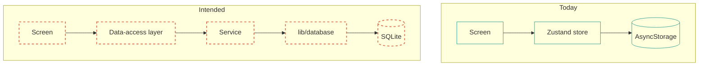

# Building an Offline-First App in Expo

**`reference`** · verified `2026-09-29` · ~5 min read

> [!NOTE]
> The previous version of this file was a launch announcement — "Building a 100% Offline
> AI-Native Life OS in 2026" — describing a shipped product. It included code samples for an
> API that does not exist (`aiService.processQuery`), claimed a working RAG assistant, and
> compared the project to a "sovereign AI-native life operating system". HyperVerse has not
> launched. This version documents the engineering and is explicit about the gaps.

## The idea

Most personal-tracking apps are thin clients over someone else's database. The interesting
question is what it takes to build one where the database *is* the backend: a local-first app
where tasks, habits, and health data never leave the device, so there is no account to create,
nothing to sync, and no server to breach.

HyperVerse is an attempt at that, built on Expo. The privacy claim is trivially true — the app
makes no network requests at all — which makes it less of a marketing point and more of a
structural property.

## What is genuinely built

### A real relational data layer

`lib/database/` is the substantive part of this repository. Twelve WatermelonDB tables with
foreign keys indexed, and a model per table carrying domain logic rather than just fields.

```ts
// lib/database/models/Task.ts
async complete(): Promise<void> {
  await this.update((task) => {
    task.status = 'completed';
    task.completedAt = Date.now();
  });
}
```

Testing a reactive database is harder than it should be, because the SQLite adapter needs a
native module Jest cannot load. The solution here was to swap only the adapter, keeping
WatermelonDB's real query engine, and let tests run against the bundled pure-JS LokiJS adapter:

```js
// jest.setup.js
jest.mock('@nozbe/watermelondb/adapters/sqlite', () => {
  const LokiJSAdapter = require('@nozbe/watermelondb/adapters/lokijs').default;
  return {
    __esModule: true,
    default: class extends LokiJSAdapter {
      constructor(options) {
        super({ ...options, useWebWorker: false, useIncrementalIndexedDB: false });
      }
    },
  };
});
```

The smoke test then does real work — create a user, create a task through the `@children`
relation, award XP, complete the task — rather than asserting that a mock was called.

### A service layer that behaves

`AuthService` is a singleton covering device identity (a crypto digest of the application ID),
profile persistence through `expo-secure-store`, biometric authentication, app lock, and JSON
export. It is the most heavily tested part of the codebase: 14 unit tests plus 15 integration
tests that exercise the real service.

### Builds that work

`npm run build` produces a static Expo Go deployment: 5.04 MB of minified JavaScript for iOS,
5.05 MB for Android, 49 assets, and valid Expo manifests. `npm run typecheck` is clean.
`npm test` runs 133 tests green.

## What does not work

The honest version of this story is that **the data layer is not connected to the UI**.

- `app/(tabs)/tasks.tsx` — the largest screen, 579 lines — renders `mockTasks`, a hardcoded
  array at line 29. Task CRUD is not persisted.
- `habits.tsx` and `settings.tsx` are 14-line placeholders.
- `ar`, `blockchain`, `iot`, and `social` hold state in component `useState` and reset on
  reload.
- The health, finance, and dashboard tabs read from a Zustand store persisted to AsyncStorage,
  which works, but is a flat demo shape that disagrees with the schema already written for it.
- **The AI assistant does not run.** `ModelManager` builds a `@xenova/transformers` pipeline
  from a local model path, and no model files ship. `AIService` is never called by a screen. The
  AI tab renders a chat UI over locally stored messages.

Coverage is 13.88% of statements, and `app/` is excluded from the coverage configuration
entirely — so the real number is lower. The two Detox specs have never been executed.

## What the layer boundaries are for

Even with the wiring incomplete, the structure is worth describing, because it determines how
the remaining work goes.



The intended end state is that screens read through a data-access layer into `lib/database`,
and the Zustand stores hold only ephemeral view state. WatermelonDB is reactive, so once a
query is subscribed the stores may not be needed for persistent state at all — which would make
the installed-but-unused `@tanstack/react-query` removable.

`@shopify/react-native-skia` and `lancedb` were both removed during development because they
could not run in this environment. The shader background is `expo-linear-gradient` plus
Reanimated; the vector store is a JSON file with cosine similarity. Both are compromises, and
both are recorded as debt.

## Notes for anyone reading the code

Three WatermelonDB rules caused real, shipped bugs here, and all three now have tests:

1. `Model.update()` only works inside `database.write()`. Otherwise:
   `Model.update() can only be called from inside of a Writer`.
2. `@readonly` fields — `createdAt`, `updatedAt` — must never be assigned. WatermelonDB sets
   them. Assigning throws.
3. `collection.query(fn)` does not exist in 0.27. Use `Q.where(...)`.

And one about tests: a test that asserts behaviour on a module it has `jest.mock`ed is
asserting its own mock. Five tests in `authFlow.test.tsx` did exactly that. They now use the
real service, because the native dependencies were already mocked and the isolation was never
necessary.

## Where to start

If you want to contribute, the highest-value task is
[Stage 1 of the roadmap](ROADMAP.md#stage-1--persist-real-data): connect one screen to
`lib/database`, starting with tasks, and delete the corresponding `dataStore` slice. The data
model is done and tested. Everything after that is wiring.

---

**Status** `reference` · **verified** `2026-09-29` · [README](README.md) ·
[Architecture](ARCHITECTURE.md) · [Roadmap](ROADMAP.md) · [Security](SECURITY.md)

[Edit this page](https://github.com/JahanzaibJameel/HyperVerse/blob/main/LAUNCH_BLOG.md) ·
[Open an issue](https://github.com/JahanzaibJameel/HyperVerse/issues/new)
