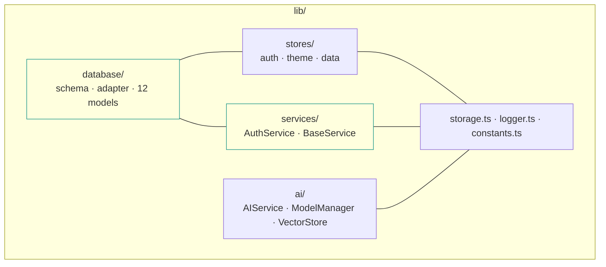

# Project Structure

**`pre-release`** · verified `2026-09-29` · ~5 min read

A map of the repository by directory. For a file-by-file inventory, see
[FOLDER_STRUCTURE.md](FOLDER_STRUCTURE.md).

> [!NOTE]
> There is **no `src/` directory.** Earlier versions of this document described one; the
> project is rooted at the repository, with `app/`, `lib/`, and `components/` as top-level
> directories.

## Contents

1. [Top level](#1-top-level)
2. [app/](#2-app)
3. [lib/](#3-lib)
4. [components/](#4-components)
5. [Supporting directories](#5-supporting-directories)
6. [Generated and untracked](#6-generated-and-untracked)

---

## 1. Top level

```text
HyperVerse/
├── app/                  Expo Router routes
├── lib/                  Database, services, stores, AI
├── components/           Reusable UI components
├── __tests__/            Jest + Detox specs
├── constants/            colors.ts
├── context/              AppContext.tsx (legacy)
├── hooks/                useColors.ts
├── scripts/              build.js
├── server/               serve.js
├── assets/               images only
├── docs/                 DEPLOYMENT.md, TESTING.md, STORYBOOK.md
├── .storybook/           main.ts, preview.tsx, index.tsx, stories/, storybook.requires.ts
├── .github/              workflows, dependabot, templates
├── eslint.config.mjs     flat ESLint config
├── jest.config.js
├── babel.config.js
├── metro.config.js
├── tsconfig.json
├── app.json              Expo config
├── package.json
├── llms.txt              machine-readable index for AI agents
└── .env.example          template; real .env is gitignored
```

## 2. app/

File-based routes. `app/_layout.tsx` mounts the providers; the two layout files group routes.

| Path | Purpose | State |
| :-- | :-- | :-- |
| `_layout.tsx` | Providers, Inter font, splash, global redirect | Real |
| `+not-found.tsx` | 404 route | Real |
| `(auth)/_layout.tsx` | Auth group layout | Real |
| `(auth)/setup.tsx` | Onboarding; creates the profile via `AuthService` | Real — **only screen that writes real data** |
| `(tabs)/_layout.tsx` | `NativeTabLayout`, `ClassicTabLayout`, auth redirect | Real |
| `(tabs)/index.tsx` | Dashboard | Demo |
| `(tabs)/tasks.tsx` | Tasks, 579 lines | Demo |
| `(tabs)/habits.tsx` | Habits | Stub |
| `(tabs)/health.tsx` | Health metrics | Demo |
| `(tabs)/finance.tsx` | Finance | Demo |
| `(tabs)/ai.tsx` | AI chat UI | Demo |
| `(tabs)/ar.tsx` | AR experience | Demo |
| `(tabs)/blockchain.tsx` | Blockchain / NFT | Demo |
| `(tabs)/iot.tsx` | IoT devices | Demo |
| `(tabs)/social.tsx` | Social feed | Demo |
| `(tabs)/settings.tsx` | Settings | Stub |
| `tasks/new.tsx` | Task creation form | Demo |
| `tasks/[id].tsx` | Task detail | Demo |

> [!IMPORTANT]
> No file under `app/` imports `lib/database`. The database is unreachable from the UI. See
> [ARCHITECTURE §2](ARCHITECTURE.md#2-data-layer).

## 3. lib/



| Path | Contents |
| :-- | :-- |
| `database/` | `schema.ts` (12 tables, v1), `database.ts` (adapter, singleton, readiness), `models/` (12 models). No migrations directory. |
| `services/` | `AuthService.ts` (device ID, biometrics, profile, export), `BaseService.ts` |
| `stores/` | `authStore`, `themeStore` |
| `ai/` | `AIService`, `models/ModelManager`, `rag/VectorStore` |
| `storage.ts` | Safe SecureStore wrappers |
| `logger.ts` | Levelled logger, optional Sentry |
| `constants.ts` | App-wide constants |

## 4. components/

| Path | Notes |
| :-- | :-- |
| `GlowCard.tsx` | Neon-bordered card; supports `onPress` and optional children |
| `NeonButton.tsx` | Primary CTA |
| `ShaderBackground.tsx` | `expo-linear-gradient` + Reanimated. **Not** Skia. |
| `XPBar.tsx`, `CircularProgress.tsx`, `MiniBarChart.tsx` | Progress and chart primitives |
| `ErrorBoundary.tsx`, `ErrorFallback.tsx`, `ErrorState.tsx` | Error handling |
| `GradientCard.tsx`, `StatBar.tsx`, `SkeletonLoader.tsx` | Layout primitives |
| `IoTDevice.tsx`, `NFTCard.tsx`, `NotificationBadge.tsx`, `LiveTicker.tsx` | Domain widgets |
| `KeyboardAwareScrollViewCompat.tsx` | Keyboard handling shim |
| `LazyScreen.tsx` | Lazy-loaded screen wrapper |

There are no `charts/` or `forms/` subdirectories.

## 5. Supporting directories

| Path | Purpose |
| :-- | :-- |
| `__tests__/` | `unit/`, `integration/`, `components/`, `database/`, `e2e/` |
| `constants/colors.ts` | Light and dark palettes consumed by `hooks/useColors.ts` |
| `hooks/useColors.ts` | Returns the palette for the active colour scheme |
| `context/AppContext.tsx` | Legacy. Declares a second `UserProfile` type predating `lib/services/AuthService`. Not imported by any screen. |
| `scripts/build.js` | Static Expo Go build pipeline |
| `server/serve.js` | Static file server for `static-build/` |
| `assets/images/` | Icon and splash images. **No `ai-models/` directory exists.** |
| `.github/` | 3 workflows, `dependabot.yml`, issue and PR templates |
| `docs/` | [DEPLOYMENT.md](docs/DEPLOYMENT.md), [TESTING.md](docs/TESTING.md) |

## 6. Generated and untracked

| Path | Notes |
| :-- | :-- |
| `static-build/` | Build output. Gitignored; excluded from ESLint, Jest, and tsconfig. |
| `.kilo/worktrees/` | Agent Manager worktrees holding full repo copies. Gitignored; excluded from lint, Jest, and tsconfig. |
| `android/`, `ios/` | Not committed. Produced by `npx expo prebuild`. |
| `coverage/` | From `npm run test:coverage` |

> [!WARNING]
> If you add a worktree or build-output directory, add it to `testPathIgnorePatterns`
> (`jest.config.js`), the `ignores` list (`eslint.config.mjs`), and `exclude`
> (`tsconfig.json`). Linting `.kilo/worktrees/` previously reported errors from an unrelated
> branch copy of the repository.

---

**Status** `pre-release` · **verified** `2026-09-29` · [README](README.md) ·
[Architecture](ARCHITECTURE.md) · [File inventory](FOLDER_STRUCTURE.md) ·
[Contributing](CONTRIBUTING.md)

[Edit this page](https://github.com/JahanzaibJameel/HyperVerse/blob/main/PROJECT_STRUCTURE.md) ·
[Open an issue](https://github.com/JahanzaibJameel/HyperVerse/issues/new)
