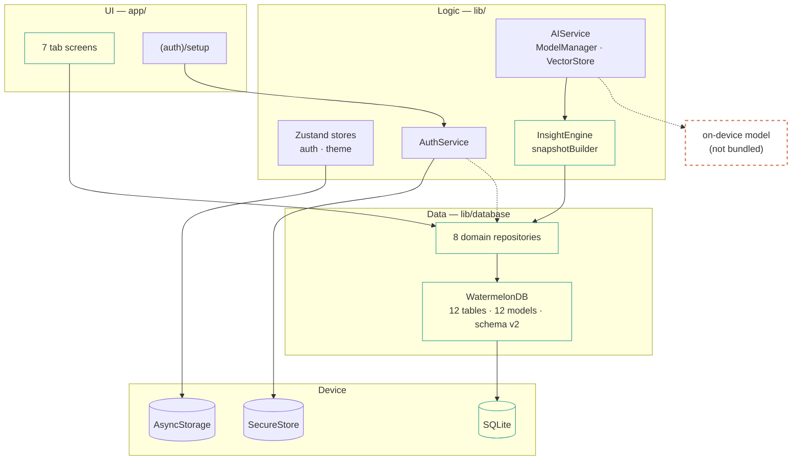

# HyperVerse

**`pre-release`** · verified `2026-10-05` · ~6 min read

An offline-first personal life-tracking app built with Expo and React Native. There is no
backend: all state lives on the device in SQLite (WatermelonDB), AsyncStorage, and
SecureStore.

> [!IMPORTANT]
> **The screens are now connected to the database.** Tasks, habits, health, finance, settings,
> and the AI assistant all read and write SQLite through `lib/database/repositories`. Measured
> test coverage is 40.52% statements. This README reports measured numbers, not targets. Read
> [Known limitations](#4-known-limitations) before relying on anything here.

## Contents

1. [What actually works](#1-what-actually-works)
2. [Verified measurements](#2-verified-measurements)
3. [Quick start](#3-quick-start)
4. [Known limitations](#4-known-limitations)
5. [Architecture at a glance](#5-architecture-at-a-glance)
6. [Tech stack](#6-tech-stack)
7. [Scripts](#7-scripts)
8. [Testing](#8-testing)
9. [Continuous integration](#9-continuous-integration)

---

## 1. What actually works

| Area | State | Evidence |
| :-- | :-- | :-- |
| Database layer | Implemented, tested | 12 tables, 12 models, schema v2 with migrations; real CRUD in `__tests__/database/smoke.test.ts` |
| Repositories | Implemented, tested | 8 domain repositories; 21 tests in `__tests__/database/repositories.test.ts` |
| Authentication | Implemented, tested | Device identity, SecureStore, biometrics, cascading delete; 14 unit + 15 integration tests |
| Screen persistence | Implemented | Tasks, habits, health, finance, settings, dashboard, and AI chat all read/write SQLite |
| AI assistant | Partially implemented | Answers grounded in your own records via the local insight engine; no model files bundled |
| State management | Implemented | `authStore`, `themeStore` (Zustand); the old AsyncStorage `dataStore` is gone |
| Build pipeline | Working | `npm run build` emits iOS + Android bundles, 49 assets, valid manifests |
| Type safety | Clean | `tsc --noEmit` → 0 errors |
| Lint | Clean | `eslint` → 0 errors, **0 warnings** |
| Tests | Passing | 219 tests, 16 suites |
| CI | Configured | Typecheck, lint, tests, coverage, and a dependency audit run on every PR |

## 2. Verified measurements

Produced on **2026-10-05** (Windows) by running the command shown.

| Check | Command | Result |
| :-- | :-- | :-- |
| Types | `npm run typecheck` | `0 errors` |
| Lint | `npm run lint` | `0 errors, 0 warnings` |
| Tests | `npm test` | `219 passed / 219 total` |
| Coverage | `npm run test:coverage` | `40.52% stmts · 36.5% branch · 34.34% funcs · 40.63% lines` (floors 38 / 34 / 33 / 38) |
| iOS bundle | `npm run build` | `5.04 MB` minified |
| Android bundle | `npm run build` | `5.05 MB` minified |

<details>
<summary>Coverage by area</summary>

Measured over the `collectCoverageFrom` globs in `jest.config.js`, which cover `lib/`,
`components/`, and `hooks/`.

| Area | Statements |
| :-- | --: |
| `hooks` | 100% |
| `lib/database/repositories` | 84.54% |
| `lib/ai/insights` | 81.51% |
| `lib/services` | 56.95% |
| `lib/database` | 46.55% |
| `lib/database/models` | 29.62% |
| `components` | 12.37% |
| `lib/stores` | 8.33% |
| `lib/ai/models`, `lib/ai/rag`, `components/ui` | 0% |

`app/` is still not in the coverage globs, so the true figure including screen code is lower
than the headline number. `lib/ai/models` and `lib/ai/rag` remain at 0% because they wrap
`@xenova/transformers`, which needs a native module Jest cannot load.

</details>

> [!WARNING]
> Bundle size is ~5 MB per platform, not the "< 4 MB" this file previously claimed. Budget
> accordingly before shipping.

## 3. Quick start

Requires Node 20+ (CI uses 24) and pnpm 9.

```bash
git clone https://github.com/JahanzaibJameel/HyperVerse.git
cd HyperVerse
pnpm install
npx expo start
```

A device or simulator needs a development build, because the app uses native modules Expo Go
does not bundle (WatermelonDB over SQLite, SecureStore, local authentication):

```bash
npx expo prebuild --platform ios
npx expo run:ios
```

For the static Expo Go build, see [docs/DEPLOYMENT.md](docs/DEPLOYMENT.md).

## 4. Known limitations

Ordered by how much each would affect someone using the app.

1. **On-device AI models are not bundled.** `assets/ai-models/` does not exist. The assistant
   therefore runs the local insight engine, which is grounded in your real records but is a
   deterministic template engine, not a language model. Downloading a model through
   `ModelManager` is wired up but untested on a real device.
2. **Coverage is 40.52% statements.** Repositories, the insight engine, auth, and hooks are genuinely
   tested. `lib/ai/models`, `lib/ai/rag`, `components/ui`, and `lib/stores` are at or near 0%,
   and `app/` is excluded from the coverage globs entirely.
3. **No encryption at rest.** `notes.is_encrypted` was removed in schema v2 rather than left as
   a column with nothing behind it. Data is in plaintext SQLite.
4. **E2E tests are unexercised.** The two Detox specs are excluded from Jest and no workflow
   runs them, so they may not even compile against a real app.
5. **Migrations are only partially exercised.** Tests run against WatermelonDB's LokiJS
   adapter, which builds a fresh schema. The v1→v2 upgrade SQL
   (`ALTER TABLE "notes" DROP COLUMN "is_encrypted";`) has never run against a real SQLite file
   written by v1.
6. **`proguard-rules.pro` is inert.** It must be copied into a generated `android/app/` after
   `expo prebuild`; no `android/` directory is committed.
7. **Settings are not reactive to external changes.** The settings screen writes through the
   repository, but edits made elsewhere will not live-update an open screen.

## 5. Architecture at a glance



All solid edges are live code paths. The **dashed** edge is the only intended path that does
not exist yet: no model files ship with the app, so `AIService` always takes the local insight
engine route unless a model has been downloaded at runtime.

## 6. Tech stack

Versions pinned in `package.json`.

| Layer | Choice | Version |
| :-- | :-- | :-- |
| Framework | Expo, new architecture enabled | `~54.0.37` |
| Runtime | React Native | `0.81.5` |
| UI | React | `19.1.0` |
| Language | TypeScript | `~5.9.2` |
| Navigation | Expo Router, typed routes, React Compiler | `~6.0.24` |
| Database | WatermelonDB over `expo-sqlite` | `^0.27.1` |
| State | Zustand | `^5.0.1` |
| AI | `@xenova/transformers` + local insight engine | `^2.17.2` |
| Animation | Reanimated | `~4.1.1` |
| Tests | Jest + React Native Testing Library; Detox for E2E | `^29.7.0`, `^20.25.3` |

> [!NOTE]
> `@shopify/react-native-skia` and `lancedb` are **not** dependencies.
> `components/ui/ShaderBackground.tsx` uses `expo-linear-gradient` and Reanimated;
> `lib/ai/rag/VectorStore.ts` is a local JSON file with cosine similarity.
> `react-i18next`, `victory-native`, `react-hook-form`, `date-fns`, `@tanstack/react-query`,
> and several `expo-*` packages were removed after an audit found zero imports.

## 7. Scripts

| Command | Does |
| :-- | :-- |
| `npx expo start` | Start the dev server — use this locally |
| `npm run build` | Static Expo Go build into `static-build/` |
| `npm run serve` | Serve the build via `server/serve.js` |
| `npm run typecheck` | `tsc --noEmit` |
| `npm test` | Jest, excluding Detox E2E specs |
| `npm run test:watch` | Jest in watch mode |
| `npm run test:coverage` | Jest with coverage |
| `npm run test:e2e` | Detox; needs an emulator and a built app |
| `npm run lint` | ESLint, check-only |
| `npm run lint:fix` | ESLint with `--fix` |
| `npm run verify` | `typecheck` + `lint` + `test` in sequence |
| `npm run bundle-report` | `react-native-bundle-visualizer` |
| `npm run storybook` | Storybook on port 8082, separate from the app |
| `npm run storybook:web` | Storybook for web on port 8082 |

> [!NOTE]
> `npm run lint` is check-only and will not modify your working tree. Use `npm run lint:fix`
> when you want ESLint to apply fixes for you. Storybook is wired up and reachable on port
> 8082 via `npm run storybook`; see [docs/STORYBOOK.md](docs/STORYBOOK.md).

## 8. Testing

```text
__tests__/
├── unit/          useColors · AuthService · User/Task model logic · insight engine · logger
├── integration/   authFlow — real service + store
├── components/    GlowCard · NeonButton
├── database/      smoke test + repository tests — real WatermelonDB CRUD
└── e2e/           Detox specs, excluded from Jest
```

`__tests__/database/smoke.test.ts` and `__tests__/database/repositories.test.ts` run against
WatermelonDB's pure-JS LokiJS adapter, swapped in by `jest.setup.js`, because the SQLite
adapter needs a native module Jest cannot load. That is why database tests exercise genuine
query and relation behaviour.

Full detail, including the mocking strategy: [docs/TESTING.md](docs/TESTING.md).

## 9. Continuous integration

All workflows run on pushes and pull requests to `main`, except `release.yml`, which runs on
`v*` tags.

| Workflow | Runs |
| :-- | :-- |
| `test.yml` | `pnpm install`, `typecheck`, `lint`, `test`, `test:coverage` |
| `test.yml` (`audit (advisory)`) | `pnpm audit --audit-level=high` in table mode. Gates the pipeline; 44 measured GHSAs are listed in `package.json` under `pnpm.auditConfig.ignoreGhsas` |
| `Web Export (advisory)` (`build.yml`) | Web export only. Advisory, and **does not deploy** — it is a no-op while `EXPO_TOKEN` is unset |
| `release.yml` | Tag-triggered release |

> [!NOTE]
> Typecheck and lint are now enforced on pull requests, and `lint` is check-only so a
> regression fails CI instead of being silently auto-fixed. The advisory `pnpm audit` job
> reports high-severity advisories without blocking unrelated fixes.
> `.github/dependabot.yml` and the issue/PR templates are present.

---

**Status** `pre-release` · **verified** `2026-09-29` · [Architecture](ARCHITECTURE.md) ·
[Structure](PROJECT_STRUCTURE.md) · [Roadmap](ROADMAP.md) · [Contributing](CONTRIBUTING.md) ·
[Security](SECURITY.md)

[Edit this page](https://github.com/JahanzaibJameel/HyperVerse/blob/main/README.md) ·
[Open an issue](https://github.com/JahanzaibJameel/HyperVerse/issues/new)
