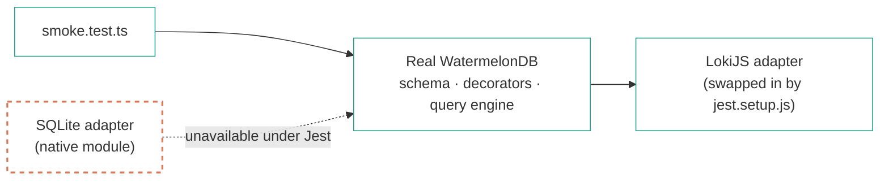

# Testing

**`pre-release`** · verified `2026-10-05` · ~7 min read

> [!NOTE]
> This guide is referenced from the [README](../README.md) but did not exist before. The
> previous README claimed "85%+ coverage" and documented a `__tests__/__mocks__/` directory
> that does not exist. Measured coverage is **40.52%** of statements.

## Contents

1. [Current state](#1-current-state)
2. [Running tests](#2-running-tests)
3. [Layout](#3-layout)
4. [Configuration](#4-configuration)
5. [Mocking strategy](#5-mocking-strategy)
6. [Testing the database](#6-testing-the-database)
7. [Adding a test](#7-adding-a-test)
8. [What is not tested](#8-what-is-not-tested)

---

## 1. Current state

Measured 2026-09-29.

| Metric | Value |
| :-- | :-- |
| Suites | 11 passing, 0 failing |
| Tests | 192 passing, 0 failing |
| Statements | 40.52% |
| Branches | 34.45% |
| Functions | 31.38% |
| Lines | 37.35% |

| Area | Statements | Notes |
| :-- | --: | :-- |
| `hooks` | 100.00% | `useColors` fully covered |
| `lib/database/repositories` | 84.54% | Real CRUD plus cascade deletion |
| `lib/ai/insights` | 81.51% | `InsightEngine` and `snapshotBuilder` |
| `lib/services` | 56.95% | `AuthService`, including logger redaction |
| `lib/database` | 46.55% | Adapter wiring, migrations |
| `lib/database/models` | 29.62% | Model tests run against mocks |
| `components` | 12.37% | `components/ui` is 0% |
| `lib/stores` | 8.33% | |
| `lib/ai/models`, `lib/ai/rag` | 0.00% | Wrap `@xenova/transformers`, which needs a native module |

> [!WARNING]
> `app/` is still **not** in the coverage globs, so the headline figure excludes all screen
> code. The true number including screens is lower than 40.52%. The most-tested code in the
> project is the repository layer — which is the right place to start, but it is not the same
> as testing that the screens work.

## 2. Running tests

| Task | Command |
| :-- | :-- |
| All suites | `npm test` |
| Watch mode | `npm run test:watch` |
| Coverage | `npm run test:coverage` |
| One file | `npx jest __tests__/database/smoke.test.ts` |
| One test by name | `npx jest -t "addXP"` |
| E2E | `npm run test:e2e` — needs an emulator and a built app |

## 3. Layout

```text
__tests__/
├── unit/
│   ├── example.test.ts
│   ├── hooks/useColors.test.ts                       (8 tests)
│   ├── services/AuthService.test.ts                  (14 tests)
│   ├── ai/insightEngine.test.ts                      (26 tests)
│   ├── logger.test.ts                                (12 tests)
│   └── database/models/{User,Task}.test.ts
├── integration/authFlow.test.tsx                     (15 tests)
├── components/{GlowCard,NeonButton}.test.tsx
├── database/smoke.test.ts                            (5 tests)
├── database/repositories.test.ts                     (21 tests)
└── e2e/{auth,userJourneys}.e2e.ts                    (Detox; excluded from Jest)
```

## 4. Configuration

`jest.config.js`:

- **Preset** `jest-expo` (`~54.0.0`, aligned with Expo SDK 54).
- **`testMatch`** `**/__tests__/**/*.test.(js|jsx|ts|tsx)` and
  `**/*.(test|spec).(js|jsx|ts|tsx)`. Note the literal dot before `(test|spec)`; it works, but
  it is not a glob character class and will not match nested directories the way you might
  expect.
- **`testPathIgnorePatterns`** excludes `node_modules`, `__tests__/e2e/` (Detox),
  `.kilo/worktrees/`, and `static-build/`.
- **`moduleNameMapper`** maps `@/` to the repository root.
- **`transformIgnorePatterns`** is pnpm-aware: it skips the `.pnpm/<id>/node_modules/` segment
  so Expo and React Native packages nested by pnpm are still transformed.
- **`testEnvironment`** is `jsdom`.

`jest.setup.js` mocks the native modules with no JS implementation under Jest:
`expo-font`, `expo-constants`, `expo-application`, `expo-crypto`, `expo-secure-store`,
`expo-local-authentication`, `expo-file-system`, `@react-native-async-storage/async-storage`,
`@xenova/transformers`, and the WatermelonDB adapter.

> [!NOTE]
> The `AsyncStorage` and `SecureStore` mocks are **stateful in-memory stores**, not stubs
> returning `null`. This matters: a stub that always resolves `null` makes every save-then-load
> round trip fail, which is how four `AuthService` tests were broken.

## 5. Mocking strategy

The guiding rule: **mock the boundary, not the subject.** Native modules and platform APIs
should be mocked; the code under test should be real.

### Mock native modules, not application code

`jest.setup.js` mocks only modules with no JS implementation under Jest. Application code is
exercised as written, which is why `authFlow.test.tsx` can assert on real `AuthService`
behaviour and `smoke.test.ts` can assert on real database results.

### Do not mock the subject of the assertion

```ts
// Wrong — asserts the mock, not the code.
jest.mock('@/lib/services/AuthService');
it('enables biometrics', async () => {
  const svc = AuthService.getInstance() as jest.Mocked<typeof AuthService>;
  expect(svc.enableBiometricAuth()).toBe(true);
  expect(svc.isBiometricAvailable).toHaveBeenCalled();   // a stub calls nothing
});
```

```ts
// Right — real service, real control flow, boundary still mocked.
const svc = AuthService.getInstance();
const isAvailable = jest.spyOn(svc, 'isBiometricAvailable');
await svc.enableBiometricAuth();
expect(isAvailable).toHaveBeenCalled();
```

The first version cannot fail meaningfully: it asserts that a `jest.fn()` was called by code that
is itself a `jest.fn()`. Five tests in `authFlow.test.tsx` were written this way.

### Do not replace whole React Native modules

`useColors.test.ts` originally did
`jest.mock('react-native', () => ({ useColorScheme: jest.fn() }))`. That discards the runtime
the renderer needs, and spreading `requireActual` re-evaluates TurboModule getters
(`Invariant Violation: 'DevMenu' could not be found`). Mock the deep module that owns the
function instead:

```ts
jest.mock('react-native/Libraries/Utilities/useColorScheme', () => ({
  __esModule: true,
  default: jest.fn(),
}));
```

### Declare `__esModule` for default exports

A factory returning `{ default: … }` without `__esModule: true` makes the default import
`undefined` under Babel interop. This silently broke the `colors` mock in `useColors.test.ts`.

### Reset stateful mocks correctly

Use `jest.clearAllMocks()` in `beforeEach` (clears calls, keeps implementations) and
`jest.restoreAllMocks()` in `afterEach` (restores `jest.spyOn` targets). Do not use
`resetAllMocks` on the in-memory stores, which would wipe their implementations.

## 6. Testing the database

WatermelonDB's SQLite adapter needs a native module, so Jest substitutes the pure-JS LokiJS
adapter that ships with WatermelonDB:

```js
jest.mock('@nozbe/watermelondb/adapters/sqlite', () => {
  const LokiJSAdapter = require('@nozbe/watermelondb/adapters/lokijs').default;
  return {
    __esModule: true,
    default: class extends LokiJSAdapter {
      constructor(options) {
        super({ ...options, useWebWorker: false, useIncrementalIndexedDB: false });
      }
    },
  };
});
```

Only the adapter is replaced. WatermelonDB's real schema, decorators, query engine, relations,
and work queue are all exercised, which is why `__tests__/database/smoke.test.ts` can assert on
genuine behaviour — including the `@children` relation between `users` and `tasks`.



> [!NOTE]
> LokiJS needs `lokijs`, which is not published on npm under the version WatermelonDB wants
> (`1.5.12-wmelon6`, a WatermelonDB fork). pnpm exposes it inside WatermelonDB's own nested
> `node_modules`, where Node resolution finds it. Adding a `moduleNameMapper` entry for
> `lokijs` is unnecessary and makes the config brittle.

## 7. Adding a test

<details>
<summary>Prefer the real models over new mocks</summary>

A mock that duplicates production logic can pass while the real model is broken — which is how
a bug affecting all twelve models went unnoticed. Add cases to
`__tests__/database/smoke.test.ts` where possible.

If you do need a mock instance, keep it faithful to the real contract:

- Methods that mutate must go through `update()`, since the real models do.
- Callers must wrap mutations in `database.write()`.
- Never assign `createdAt` or `updatedAt`; they are `@readonly`.

</details>

<details>
<summary>Component test notes</summary>

Wrap text children in `<Text>` — bare strings are not queryable in React Native. Use
`fireEvent` from `@testing-library/react-native` rather than calling handlers directly.

</details>

## 8. What is not tested

- **`app/`** — no screen has a test, and `app/` is excluded from the coverage globs. The
  repositories behind the screens are well covered; the screens calling them are not.
- **`lib/ai/models` and `lib/ai/rag`** — 0%. Both wrap `@xenova/transformers`, which needs a
  native module Jest cannot load, so this needs a device test or a manual verification pass
  rather than a mock.
- **`lib/stores/`** — 8.33%.
- **`components/ui/ShaderBackground.tsx`** — 0%.
- **Schema migrations** — tests build a fresh schema with the LokiJS adapter, so the v1→v2
  `ALTER TABLE "notes" DROP COLUMN "is_encrypted"` upgrade path has never actually run.
- **Detox E2E** — the two specs are excluded from Jest and no CI workflow runs them, so they
  have never been executed and may not compile against a real app.

The Storybook stories that used to sit in this list have been deleted, along with the
unreachable `.storybook` config and the stub scripts that referenced them.

Raising coverage is tracked in [ROADMAP Stage 4](../ROADMAP.md#stage-4--ship).

---

**Status** `pre-release` · **verified** `2026-09-29` · [README](../README.md) ·
[Contributing](../CONTRIBUTING.md) · [Architecture](../ARCHITECTURE.md) ·
[Technical debt](../ROADMAP_V2.md)

[Edit this page](https://github.com/JahanzaibJameel/HyperVerse/blob/main/docs/TESTING.md) ·
[Open an issue](https://github.com/JahanzaibJameel/HyperVerse/issues/new)
